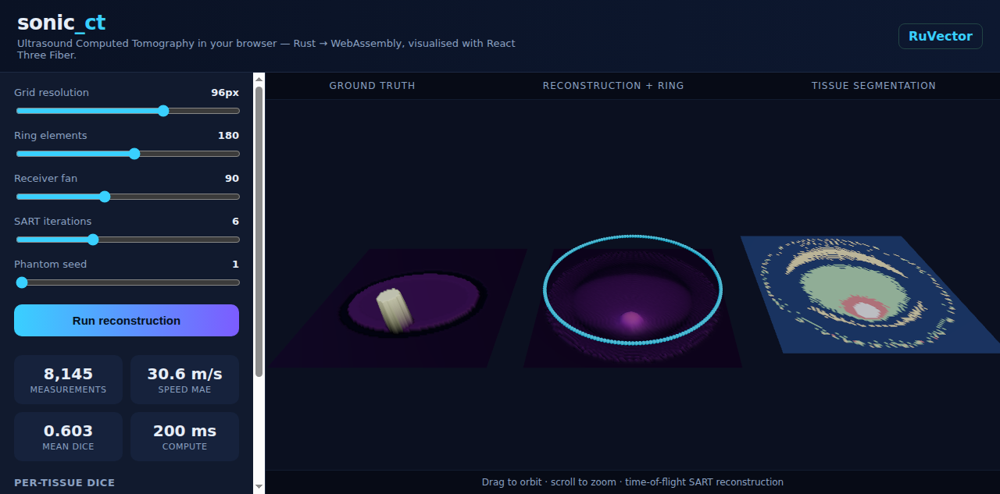

<div align="center">

# 🔊 sonic_ct — Ultrasound Computed Tomography in Rust + WebAssembly

**A dependency-free, browser-ready ultrasound CT (USCT) simulator and reconstruction toolkit.**
Synthetic phantoms · ring acquisition · time-of-flight SART reconstruction · tissue segmentation · self-learning acoustic memory — all in pure Rust, compiled to WebAssembly, visualised with React Three Fiber.

[](https://www.rust-lang.org/)
[](https://webassembly.org/)
[](https://docs.pmnd.rs/react-three-fiber)
[](#license)
[](#testing)
[](#why-raw-webassembly)

</div>

> **Keywords:** ultrasound computed tomography, USCT, transmission ultrasound, time-of-flight tomography, SART reconstruction, full-waveform inversion, tissue segmentation, body composition imaging, Rust WebAssembly medical imaging, React Three Fiber visualization, RuVector vector memory.

---

## What is this?

`sonic_ct` models a **ring ultrasound CT scanner** — the kind of architecture behind next-generation full-body scanners that immerse a subject in a water bath and surround them with a dense ring of ultrasound transducers. Every element transmits and receives, so sound passes *through* the body from hundreds of angles. From those measurements the system reconstructs maps of acoustic properties (speed of sound, attenuation), segments them into tissue classes, and scores the result against ground truth.

It is **research/simulation software**. It makes **no diagnostic claim**, and the hardware integration point (a "Butterfly Embedded"-style backend) is a **mock adapter behind a trait**, not a hardware SDK.

<div align="center">

<br/><em>Live in the browser: ground truth · reconstruction + transducer ring · tissue segmentation. ~8,000 simulated measurements reconstructed in ~130 ms of WebAssembly compute.</em>
</div>

---

## Why it's interesting

| Property | Detail |
|---|---|
| **Zero dependencies** | The core crate uses *no* third-party crates — just `std`. Reproducible, auditable, tiny. |
| **Runs anywhere** | Native CLI, library, and `wasm32-unknown-unknown` from one codebase. |
| **Raw WebAssembly** | No `wasm-bindgen`, no `wasm-pack` — a **31 KB** module with a stable C ABI and zero imports. |
| **Real physics** | Straight-ray time-of-flight tomography solved with **SART** (Simultaneous Algebraic Reconstruction). |
| **It learns** | A trainable segmentation model and a **RuVector-style acoustic memory** (vector index + anatomical graph checks). |
| **It's honest** | Bone reconstructs poorly with straight rays — and we say so. Full-waveform inversion is the documented next step. |

---

## Quick start

### Run the simulator (native)

```bash
cd crates/sonic-ct

# One-shot reconstruction → PGM images + metrics
cargo run --release --bin sonic_ct_demo /tmp/out

# Train the segmentation model on a synthetic corpus + build the acoustic memory
cargo run --release --bin sonic_ct_train 24 /tmp/out

# Run the full test suite (16 tests)
cargo test --release
```

Example demo output:

```
== sonic_ct demo ==
grid:          96x96
elements:      180
measurements:  8688
MAE (speed):   27.88 m/s
mean Dice:     0.63
coherence:     bone↔water=0 organ↔water=… anomaly=…
```

### Run the browser UI (React Three Fiber)

```bash
cd examples/sonic-ct
npm install
npm run dev        # auto-builds the WASM via scripts/build-sonic-ct-wasm.sh
# open http://localhost:5184
```

Drag to orbit, scroll to zoom, move the sliders, and hit **Run reconstruction** to recompute live in WebAssembly.

### Use as a library

```rust
use sonic_ct::pipeline::{run, PipelineConfig};

let scene = run(PipelineConfig::default()).unwrap();
println!("mean Dice = {:.3}", scene.quality.mean_dice);
println!("speed MAE = {:.1} m/s", scene.quality.mae_speed);
```

---

## How it works

```
phantom ─▶ ring ─▶ acquisition ─▶ SART reconstruction ─▶ segmentation ─▶ metrics
                                         │                                   │
                                         └────────── acoustic memory ◀───────┘
```

1. **Phantom** (`phantom.rs`) — a deterministic, seed-controlled abdomen cross-section: a fat envelope, a muscle wall, organ parenchyma, and a vertebral bone disc. Reproducible "public" data with no external download.
2. **Ring** (`geometry.rs`) — transducer positions on a circle, with transmit *fans* that skip grazing near-neighbour paths.
3. **Acquisition** (`acquisition.rs`) — for every source/receiver pair, sound is integrated along a straight ray: travel time (vs. a water reference) and attenuation, with optional timing noise.
4. **Reconstruction** (`reconstruction.rs`) — **SART** solves the tomography system `A·s = t` for per-cell slowness. *One* sweep equals the classic delay-backprojection baseline; more sweeps approach the least-squares image.
5. **Segmentation** (`segmentation.rs`) — a transparent speed-band classifier assigns tissue labels and a **per-cell uncertainty** from each pixel's margin to the nearest decision boundary.
6. **Metrics** (`metrics.rs`) — Dice per class, mean Dice, and mean-absolute speed error.

### The acoustic memory (RuVector integration)

`memory.rs` is the `sonic_ct` analogue of [RuVector](https://github.com/ruvnet/ruvector)'s spatial memory. Each reconstruction becomes a mean-centred, L2-normalised descriptor stored in a **navigable small-world (NSW) graph** for sub-linear nearest-neighbour search. That enables:

- **Longitudinal tracking** — compare a subject's scans over time by semantic similarity, not brittle pixel alignment (`longitudinal_drift`).
- **FWI warm-starting** — retrieve the closest previously solved reconstruction as an initial model (`warm_start`).
- **Anomaly detection** — `check_coherence` treats the segmentation as a graph and flags anatomically impossible geometry (e.g. *bone touching the water bath*).
- **Portable, auditable archives** — the index round-trips through a compact `.rvf`-style binary container, satisfying the "preserve raw evidence" governance rule (ADR-0003).

### Training the model

`model.rs` fits the segmentation thresholds by **coordinate ascent** over a labelled corpus, maximising mean Dice. On the synthetic data this roughly **doubles mean Dice (≈0.30 → ≈0.63)** versus literature-default boundaries — and the tuned model ships as the default in the live WASM demo.

---

## Why raw WebAssembly?

Most Rust→WASM projects depend on `wasm-bindgen` + `wasm-pack`, which couple your build to a specific toolchain version. `sonic_ct` instead exports a **small, stable C ABI** (`sct_run`, scalar getters, and `*_ptr` buffer getters). The JS loader (`examples/sonic-ct/src/sonicct.js`) reads flat `Float32Array`/`Uint8Array` views straight from linear memory:

```js
const sct = await SonicCT.load("sonic_ct.wasm");
const r = sct.run({ n: 96, elements: 180, fan: 90, iters: 6, seed: 1 });
console.log(r.meanDice, r.mae, r.reconSpeed); // typed-array, zero-copy
```

Result: a **31 KB**, zero-import module that builds with a single `cargo build --target wasm32-unknown-unknown` — no extra tooling.

---

## Testing

```bash
cargo test --release      # 6 unit + 9 integration + 1 doctest = 16 tests
cargo clippy --release    # lint-clean core library
```

The suite verifies the pipeline beats a flat-water prior, Dice scores stay in range, the NSW index matches brute-force top-1, the memory container round-trips, anatomical coherence flags impossible geometry, training never regresses, and the Butterfly mock backend matches direct simulation. A Node smoke test instantiates the WASM and exercises the full surface.

---

## Honest limitations

- **Bone is hard.** Straight-ray time-of-flight blurs the small, high-contrast spine, so bone Dice is near zero. This is the textbook motivation for **full-waveform inversion (FWI)** — the documented next step on the roadmap.
- **2-D today.** `volume3d.rs` scaffolds the vertical-sweep geometry; full 3-D reconstruction is future work.
- **Simulated, not clinical.** No real RF waveforms, no patient data, no diagnosis.

---

## Roadmap

TOF SART (done) → finite-difference wave propagation → adjoint-state **FWI** → frequency continuation + source encoding → learned sparse completion → 3-D vertical-sweep reconstruction → DICOMweb / FHIR export adapters → quality-system + clinical-validation harness.

See [`docs/sonic-ct/`](../../docs/sonic-ct/) for the **research map**, **market brief**, **SPARC analysis**, and **8 ADRs**.

---

## License

Dual-licensed under **MIT** or **Apache-2.0**, at your option. Part of the [RuVector](https://github.com/ruvnet/ruvector) ecosystem.
